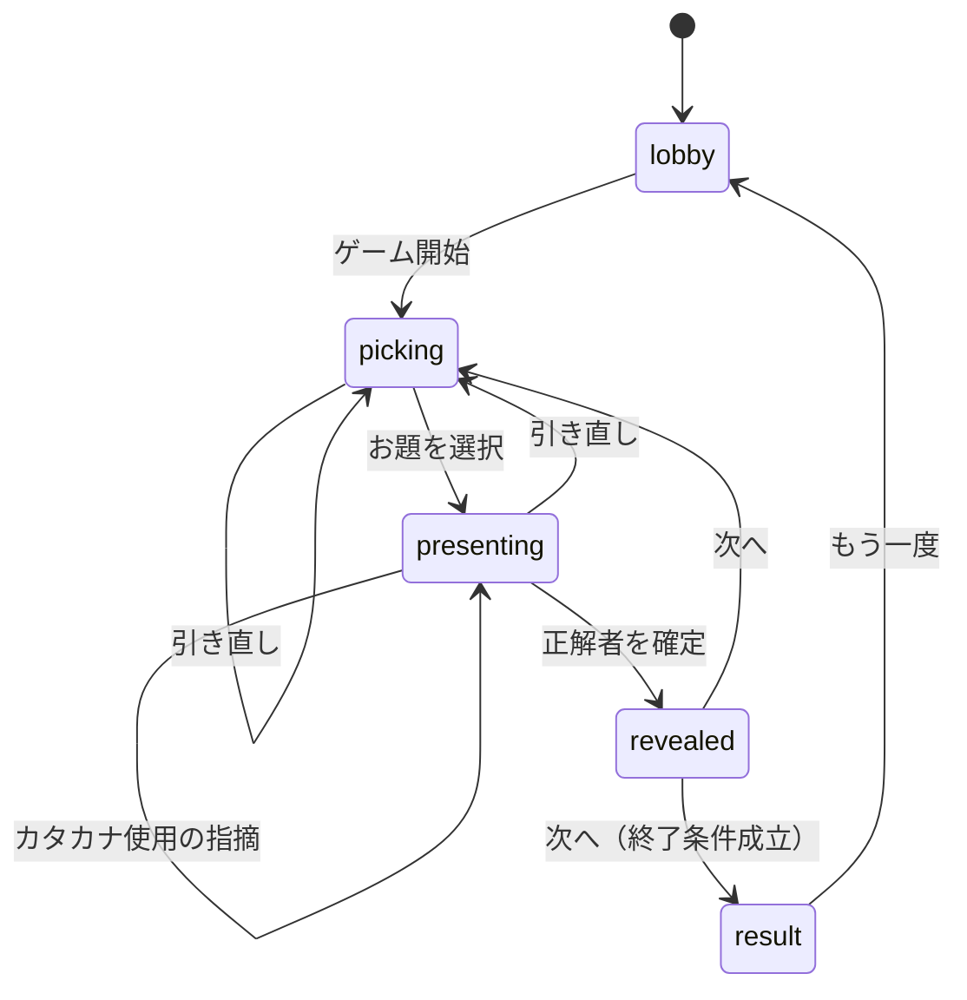

# フェーズ2 詳細設計: ゲーム状態遷移

## 0. 位置づけ

フェーズ2（得点管理・終了条件・リアルタイム同期）の基盤となる状態と振る舞いを定義する。
1〜4章は同期の有無に依存しない。5〜6章が同期版固有の要件。

---

## 1. 状態

| 状態         | 意味                                     |
| ------------ | ---------------------------------------- |
| `lobby`      | 参加者登録・終了条件設定                 |
| `picking`    | 3候補を提示し、出題者が選択する          |
| `presenting` | 出題中。説明と回答が行われる             |
| `revealed`   | 結果表示。お題と加点結果を全員に開示する |
| `result`     | 最終ランキング                           |

`revealed` を独立させるのは、**加点の適用タイミングを1点に固定する**ため。`presenting` から直接次の出題へ戻すと、加点が遷移の副作用に埋もれる。

---

## 2. 遷移

| 状態         | 操作                  | 振る舞い                                            | 次状態       |
| ------------ | --------------------- | --------------------------------------------------- | ------------ |
| `lobby`      | 参加者追加            | 参加者リストに加わる                                | `lobby`      |
| `lobby`      | 終了条件設定          | 終了条件を更新                                      | `lobby`      |
| `lobby`      | ゲーム開始（2名以上） | 候補を抽選                                          | `picking`    |
| `picking`    | お題を選択            | お題確定。出題済みに記録                            | `presenting` |
| `picking`    | 引き直し              | 消費を1加算し、候補を再抽選                         | `picking`    |
| `presenting` | 引き直し              | 消費を1加算し、候補を再抽選。**出題者は交代しない** | `picking`    |
| `presenting` | お助け機能を使用      | 消費を1加算し、内容を開示                           | `presenting` |
| `presenting` | カタカナ使用の指摘    | 指摘者に +1                                         | `presenting` |
| `presenting` | 正解者を確定          | 出題者・正解者に加点。出題回数を加算                | `revealed`   |
| `revealed`   | 次へ                  | 出題者を次の人へ進め、候補を抽選                    | `picking`    |
| `revealed`   | 次へ（終了条件成立）  | —                                                   | `result`     |
| `result`     | もう一度              | 得点と履歴を初期化                                  | `lobby`      |

**出題ターンは正解が出るまで終わらない。** 引き直しは何度でも可能で、そのたびに消費が積み上がる。出題者が交代するのは正解が確定したときのみ（例外は 5 章の強制スキップ）。

---

## 3. 得点

### 3.1. 計算式

- **正解者:** その出題の難易度と同じ点数（1〜3点）。常に満額
- **出題者:** `難易度 − 消費数`。**下限は 0**
- **カタカナ使用を指摘した者:** +1

「消費」は出題ターン内で以下を使った回数の合計。引き直しをまたいで累積する。

- 引き直し
- カテゴリ公開
- 関連語ホワイトリスト
- ワン・カタカナ

**文字数の公開は無料。** 常時公開の基本ルールであり、消費に数えない。

### 3.2. なぜこの設計か

**難易度選択をリスクの賭けに変換するため。** 難易度3を無補助で説明できれば3点だが、補助を2つ使えば1点まで落ち、難易度1を無補助で成功させた場合と同値になる。「自分は補助なしでこれを説明できるか」という自己評価が、そのまま期待値の判断になる。

**コストの発生を出題者自身が制御する点が重要。** 回答者の行動によって出題者が減点される経路が存在しないため、談合（全員が沈黙して首位を削る）が成立しない。何も使わずに粘る選択は常に無料。

**正解者が満額を得るのは、補助を使ったのが出題者だからである。** 回答者側の得点を削ると、難易度の高い語で正解する動機が下がる。

### 3.3. 引き直しと降参を統合した理由

当初は「出題前のパス」と「出題後の降参」を分けていたが、両方を同一の -1 に統一した。

分けたまま降参を無料にすると、**お助け機能が完全に劣位になる**。説明に詰まったとき、1点払って補助を得るより、無料で降参して新しいお題を引くほうが常に得だからである。出題者の選択肢（補助を使う / 引き直す / 粘る）を対等なコストに置くことで、初めて選択として成立する。

回数制限は設けない。**減点と回数制限を両方課すと調整すべきパラメータが2つになり、遊んで調整する際に原因を切り分けられなくなる。** 難易度3で2回使えば1点まで落ちるため、減点だけで乱用は抑止される。それでも乱用されるなら、後から回数制限を足す。

### 3.4. 難易度データについて

`difficulty` は「語の知名度」を表す軸であり、「説明の難しさ」とは別軸であることが運用で確認されている。後者は数値化せず、出題者の選択判断に委ねる。

---

## 4. 終了条件

**フェーズ2では「全員が n 問出題したら終了」のみを実装する。** 制限時間方式は以降のエンハンスで追加する。

- 出題回数は**正解が出た出題のみ**を数える。引き直しは消化しない。
- 既定値は n = 3。運用実績（1人3〜4問、1問2〜3分、7名で45〜85分）に基づく。
- 設定 UI は将来「制限時間」を選べる構造で用意し、当面は出題数のみ選択可能とする。

制限時間を後回しにするのは、全員の画面に同一の残り時間を表示する必要があり、同期の難度が一段上がるため。

---

## 5. 運用上の規定

### 5.1. 制限時間は設けない

運用実績で1問2〜3分、場が止まった事例なし。時間切れの自動判定を実装する根拠がない。説明が続かない場合は出題者が引き直す。

### 5.2. カタカナ使用の指摘は自己申告で判定する

指摘を受けた出題者が違反を認めれば指摘者に +1、認めなければ何も起きない。**出題者の得点は減らさない。**

判定を自己申告にするのは、正解判定と異なり出題者自身が被告になるため。本ゲームの他のルール（ワン・カタカナ、お助け機能）がすべて自己申告制であることとも一貫する。

指摘の回数制限は当面設けない。「回答するより指摘を狙うほうが得」という状況が実際に生じたら、1出題につき1人1回までに絞る。

### 5.3. 出題者はラウンドロビンで交代する

本家は「正解者が次の出題者」だが採らない。7名では出題機会が偏り、一度も出題できない参加者が出るリスクがあるため。終了条件「全員が n 問出題」とも整合する。

### 5.4. 出題済みの記録は「選択した1語」のみ

3候補のうち選ばれなかった2語は未出題として残す。表示されただけで使用済みにすると語の消費が3倍になり、必要な語彙量が3倍になる。

### 5.5. 語が枯渇したら出題済み記録をリセットする

いずれかの難易度で候補を抽選できなくなった時点で、出題済み記録を全消去して再利用を許可する。

**リセットが発生したことを画面に表示する。** 通知がないと、既出の語が再び現れた理由が参加者に分からず混乱する。

### 5.6. 離脱への対処

飲み会中は端末スリープや回線断が頻発する。**ホストが現在の出題者を強制的にスキップできる操作**を用意する。加点せず、出題回数も加算せず、出題者を次の人へ進める。

---

## 6. 実行主体と情報の公開範囲（同期版）

### 6.1. 実行主体

- **ホストのみ:** ゲーム開始、終了条件設定、もう一度、強制スキップ
- **現在の出題者のみ:** お題を選択、引き直し、お助け機能を使用、正解者を確定
- **出題者以外の全員:** カタカナ使用の指摘
- **参加者本人:** ルームへの入室

**実行主体はサーバ側で検証する。** クライアントで UI を出し分けるだけでは不十分。

### 6.2. 公開範囲

**同期版の最重要要件。**

- **出題者のみ:** 3つの候補、出題中のお題
- **全員:** 進行状態、参加者と得点、現在の出題者、出題ターン内の消費数、終了条件、直前の結果
- **出題中に全員へ公開してよいお題の情報:** 難易度、文字数、およびお助け機能で開示されたカテゴリ・関連語

出題中のお題そのものを全参加者へ送信し、クライアント側で表示を隠す実装は**不可**。開発者ツールで参照できてしまう。

**お題の識別子も出題中は送信してはならない。** お題データは静的データとして全クライアントが保持しているため、識別子が漏れれば答えが判明する。

`revealed` に遷移した時点で全員に開示する。

---

## 7. 未確定事項

1. 同期の技術選定。6章が確定してから評価する
2. 得点の調整パラメータ（引き直し・お助け機能のコスト -1、終了条件 n = 3）は運用しながら見直す前提。定数として1箇所に集約する
