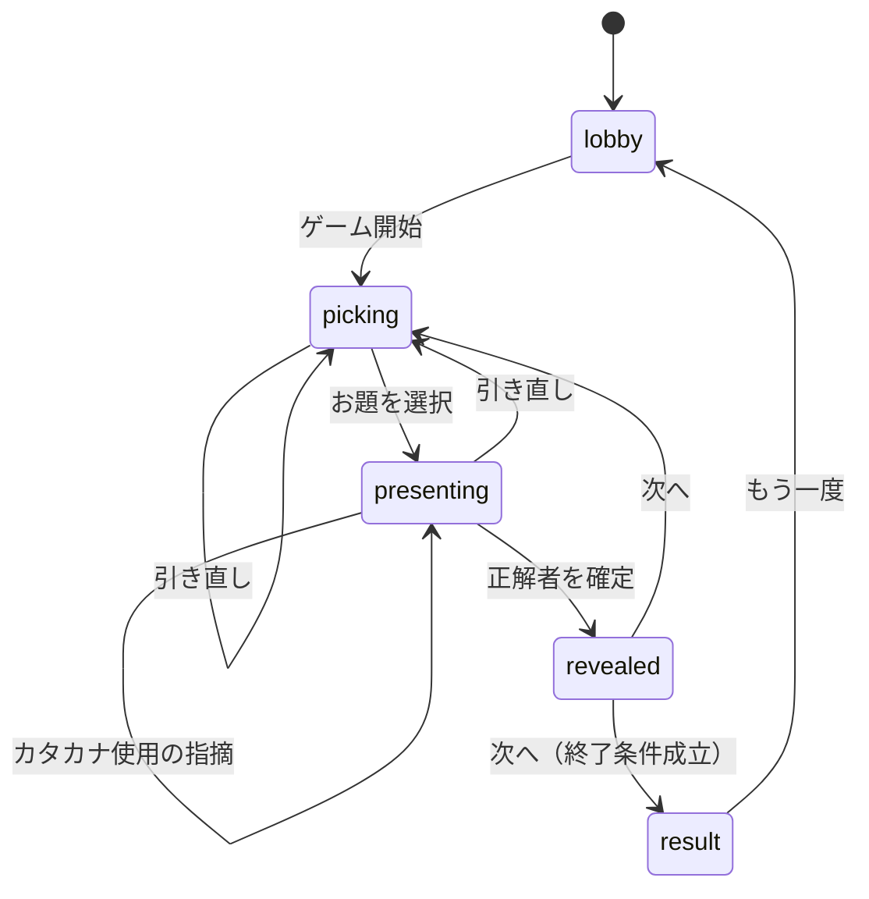

# フェーズ2 詳細設計: ゲーム状態遷移

## 0. 位置づけ

フェーズ2（得点管理・終了条件・リアルタイム同期）の基盤となる状態と振る舞いを定義する。
1〜5章は同期の有無に依存しない。6〜7章が同期版固有の要件。

---

## 1. 状態

| 状態 | 意味 |
| --- | --- |
| `lobby` | 参加者登録・終了条件設定 |
| `picking` | 3候補を提示し、出題者が選択する |
| `presenting` | 出題中。説明と回答が行われる |
| `revealed` | 結果表示。お題と加点結果を全員に開示する |
| `result` | 最終ランキング |

`revealed` を独立させるのは、**加点の適用タイミングを1点に固定する**ため。`presenting` から直接次の出題へ戻すと、加点が遷移の副作用に埋もれる。

---

## 2. 遷移

| 状態 | 操作 | 振る舞い | 次状態 |
| --- | --- | --- | --- |
| `lobby` | 参加者追加 | 参加者リストに加わる | `lobby` |
| `lobby` | 終了条件設定 | 終了条件を更新 | `lobby` |
| `lobby` | ゲーム開始（2名以上） | 候補を抽選 | `picking` |
| `picking` | お題を選択 | お題確定。出題済みに記録 | `presenting` |
| `picking` | 引き直し | 消費を1加算し、候補を再抽選 | `picking` |
| `presenting` | 引き直し | 消費を1加算し、候補を再抽選。**出題者は交代しない** | `picking` |
| `presenting` | お助け機能を使用 | 消費を1加算し、内容を開示 | `presenting` |
| `presenting` | カタカナ使用の指摘 | 指摘者に +1 | `presenting` |
| `presenting` | 正解者を確定 | 出題者・正解者に加点。出題回数を加算 | `revealed` |
| `revealed` | 次へ | 出題者を次の人へ進め、候補を抽選 | `picking` |
| `revealed` | 次へ（終了条件成立） | — | `result` |
| `result` | もう一度 | 得点と履歴を初期化 | `lobby` |
| 進行中 | 強制スキップ | 加点も出題回数の加算もせず、出題者を次の人へ進める | `picking` |
| 進行中 | ホスト移譲 | ホストを別の参加者へ変更する | 変化なし |

**出題ターンは正解が出るまで終わらない。** 引き直しは何度でも可能で、そのたびに消費が積み上がる。出題者が交代するのは正解が確定したときと、強制スキップされたときのみ。

---

## 3. 得点

### 3.1. 計算式

* **正解者:** その出題の難易度と同じ点数（1〜3点）。常に満額
* **出題者:** `難易度 − 消費数`。**下限は 0**
* **カタカナ使用を指摘した者:** +1

「消費」は出題ターン内で以下を使った回数の合計。引き直しをまたいで累積する。

* 引き直し
* カテゴリ公開
* 関連語ホワイトリスト
* ワン・カタカナ

**文字数の公開は無料。** 常時公開の基本ルールであり、消費に数えない。

### 3.2. なぜこの設計か

**難易度選択をリスクの賭けに変換するため。** 難易度3を無補助で説明できれば3点だが、補助を2つ使えば1点まで落ち、難易度1を無補助で成功させた場合と同値になる。「自分は補助なしでこれを説明できるか」という自己評価が、そのまま期待値の判断になる。

**コストの発生を出題者自身が制御する点が重要。** 回答者の行動によって出題者が減点される経路が存在しないため、談合（全員が沈黙して首位を削る）が成立しない。何も使わずに粘る選択は常に無料。

**正解者が満額を得るのは、補助を使ったのが出題者だからである。** 回答者側の得点を削ると、難易度の高い語で正解する動機が下がる。

### 3.3. 引き直しと降参を統合した理由

出題前のパスと出題後の降参を分けたまま降参を無料にすると、**お助け機能が完全に劣位になる**。説明に詰まったとき、1点払って補助を得るより、無料で降参して新しいお題を引くほうが常に得だからである。出題者の選択肢（補助を使う / 引き直す / 粘る）を対等なコストに置くことで、初めて選択として成立する。

回数制限は設けない。減点と回数制限を両方課すと調整すべきパラメータが2つになり、遊んで調整する際に原因を切り分けられなくなる。難易度3で2回使えば1点まで落ちるため、減点だけで乱用は抑止される。

### 3.4. 難易度データについて

`difficulty` は「語の知名度」を表す軸であり、「説明の難しさ」とは別軸であることが運用で確認されている。後者は数値化せず、出題者の選択判断に委ねる。

---

## 4. 終了条件

**フェーズ2では「全員が n 問出題したら終了」のみを実装する。** 制限時間方式は以降のエンハンスで追加する。

* 出題回数は**正解が出た出題のみ**を数える。引き直しと強制スキップは消化しない。
* 既定値は n = 3。運用実績（1人3〜4問、1問2〜3分、7名で45〜85分）に基づく。
* 設定 UI は将来「制限時間」を選べる構造で用意し、当面は出題数のみ選択可能とする。

制限時間を後回しにするのは、全員の画面に同一の残り時間を表示する必要があり、同期の難度が一段上がるため。

---

## 5. 運用上の規定

### 5.1. 制限時間は設けない

運用実績で1問2〜3分、場が止まった事例なし。時間切れの自動判定を実装する根拠がない。説明が続かない場合は出題者が引き直す。

### 5.2. カタカナ使用の指摘は自己申告で判定する

指摘を受けた出題者が違反を認めれば指摘者に +1、認めなければ何も起きない。**出題者の得点は減らさない。**

判定を自己申告にするのは、正解判定と異なり出題者自身が被告になるため。本ゲームの他のルールがすべて自己申告制であることとも一貫する。

指摘の回数制限は当面設けない。「回答するより指摘を狙うほうが得」という状況が実際に生じたら、1出題につき1人1回までに絞る。

### 5.3. 出題者はラウンドロビンで交代する

本家は「正解者が次の出題者」だが採らない。7名では出題機会が偏り、一度も出題できない参加者が出るリスクがあるため。終了条件「全員が n 問出題」とも整合する。

### 5.4. 出題済みの記録は「選択した1語」のみ

3候補のうち選ばれなかった2語は未出題として残す。表示されただけで使用済みにすると語の消費が3倍になり、必要な語彙量が3倍になる。

### 5.5. 語が枯渇したら、その難易度の出題済み記録をリセットする

候補を抽選できなくなった難易度についてのみ、出題済み記録を消去して再利用を許可する。全難易度を一括でリセットすると、先に尽きた難易度の巻き添えで、まだ余っている難易度の履歴まで失われる。

**リセットが発生した難易度を画面に表示する。** 通知がないと、既出の語が再び現れた理由が参加者に分からず混乱する。

### 5.6. 途中参加はできない

参加者の登録は `lobby` でのみ可能。ゲーム開始後の新規参加は受け付けない。得点と出題順の一貫性を保つため。

---

## 6. 離脱と再接続（同期版）

飲み会中は端末スリープ、電波の弱い店内、トイレでの離席などにより、数十秒から数分の切断が日常的に発生する。**切断を異常ではなく通常の事象として扱う。**

### 6.1. 接続状態はゲームの状態に含めない

誰が接続中かは移り変わる情報であり、ゲームの状態ではない。

* **同期レイヤが持つもの:** 接続と参加者の対応、参加者ごとの秘密トークン、誰が接続中か、各種タイマー
* **ゲームの状態が持つもの:** 参加者・得点・進行状態のみ

同期レイヤはタイマーの満了を検知したときにだけ、既存の操作（強制スキップ、ホスト移譲）をゲームの状態へ適用する。**状態遷移の純粋性を保ち、既存のテストをそのまま維持するための分離である。**

### 6.2. 秘密トークンによる本人確認

入室時に参加者ごとの秘密トークンを発行し、クライアントが保持する。以降の操作と再入室は、このトークンで本人を確認する。

**トークンが必要な理由は再入室である。** 自己申告の識別子だけで再入室を許すと、識別子を知っている者が他人の席を乗っ取れる。得点も、出題者であればお題も引き継がれてしまう。あわせて、出題者へのなりすましによる 7.2 の秘匿要件の突破と、同一 URL を複数タブで開いた際の席の衝突も防げる。

**トークンは発行先の接続にのみ返し、全員に配信する状態には決して含めない。**

### 6.3. 再入室の判定

* **既存の参加者のトークンが提示された** → その参加者として接続を再紐づけ。状態全体を送信し、出題者であればお題も送る
* **トークンなし、または未知のトークン** → 待機中なら新規参加者として登録。ゲーム開始後は拒否（5.6）

**同一参加者から2つ目の接続が来た場合、古い接続を切断して新しい方を採用する。** 両方を生かすと、出題者のお題が放置された端末に表示されたまま残る。

### 6.4. 席の解放

トークンを失った場合（履歴の削除、別ブラウザからの接続など）、その参加者は自分の席に戻れない。**ホストが席を解放できる操作を用意する。**

解放された席は空席となり、トークンを持たない接続が入室できる。**得点と出題回数は席に紐づいたまま維持される。** 参加者リストからは削除しないため、出題順と終了条件の判定に影響しない。

### 6.5. 出題者の離脱

他の参加者の画面に「出題者が離脱しています。再接続を待っています」を表示する。出題者が持つ情報は元から他の参加者に見えていないため、それ以外に変わるものはない。

**主たる復旧手段はホストによる強制スキップ。** 気づいた時点で即座に押せる。

**自動スキップはその保険とし、切断から3分で発動する。** 短い閾値にしてはならない。1分程度で自動スキップすると、離席から戻った参加者の順番が消えている事故が頻発する。

**再接続時にタイマーを必ず解除する。** 解除を忘れると、復帰した出題者が説明の途中でスキップされる。

### 6.6. ホストの離脱

ホストの切断から3分で、**参加者リストの先頭に近い順で、ホスト以外の接続中の参加者**へホスト権限を移譲する。

**元のホストが復帰しても権限は自動で戻さない。** 権限が黙って行き来すると、押せていたボタンが押せなくなる混乱が生じる。復帰したホストは通常の参加者として扱う。

### 6.7. ルームの寿命

**最終操作から24時間が経過したルームは、状態を削除する。**

### 6.8. タイマーの実装上の制約

同期レイヤで設定できる時限処理は同時に1つのみ。本設計では以下の3種類の期限が並行する。

* 出題者の離脱による自動スキップ（3分）
* ホストの離脱による権限移譲（3分）
* ルームの破棄（24時間）

各期限を保存し、**最も早いものに時限処理を合わせ、発火時に期限切れのものをすべて処理して次の期限を再設定する。**

---

## 7. 実行主体と情報の公開範囲（同期版）

### 7.1. 実行主体

* **ホストのみ:** ゲーム開始、終了条件設定、もう一度、強制スキップ、席の解放
* **ホストまたは現在の出題者:** 次へ（ホストが会話に集中している間もゲームが止まらないようにするため）
* **現在の出題者のみ:** お題を選択、引き直し、お助け機能を使用、正解者を確定、カタカナ使用の指摘を認める
* **参加者本人:** ルームへの入室、再入室
* **同期レイヤ:** タイマー満了による強制スキップ、ホスト移譲

**実行主体はサーバ側で検証する。** クライアントで UI を出し分けるだけでは不十分。

### 7.2. 公開範囲

**同期版の最重要要件。**

* **出題者のみ:** 3つの候補、出題中のお題
* **本人のみ:** 秘密トークン
* **全員:** 進行状態、参加者と得点、現在の出題者、出題ターン内の消費数、終了条件、直前の結果、リセットが発生した難易度、誰が離脱中か
* **出題中に全員へ公開してよいお題の情報:** 難易度、文字数、およびお助け機能で開示されたカテゴリ・関連語

出題中のお題そのものを全参加者へ送信し、クライアント側で表示を隠す実装は**不可**。開発者ツールで参照できてしまう。

**お題の識別子も出題中は送信してはならない。** お題データは静的データとして全クライアントが保持しているため、識別子が漏れれば答えが判明する。

`revealed` に遷移した時点で全員に開示する。

---

## 8. 未確定事項

なし。技術選定は `docs/phase2_sync_tech_selection.md` を参照。

得点の調整パラメータ（引き直し・お助け機能のコスト、終了条件 n、離脱のタイムアウト）は運用しながら見直す前提で、定数として1箇所に集約する。
